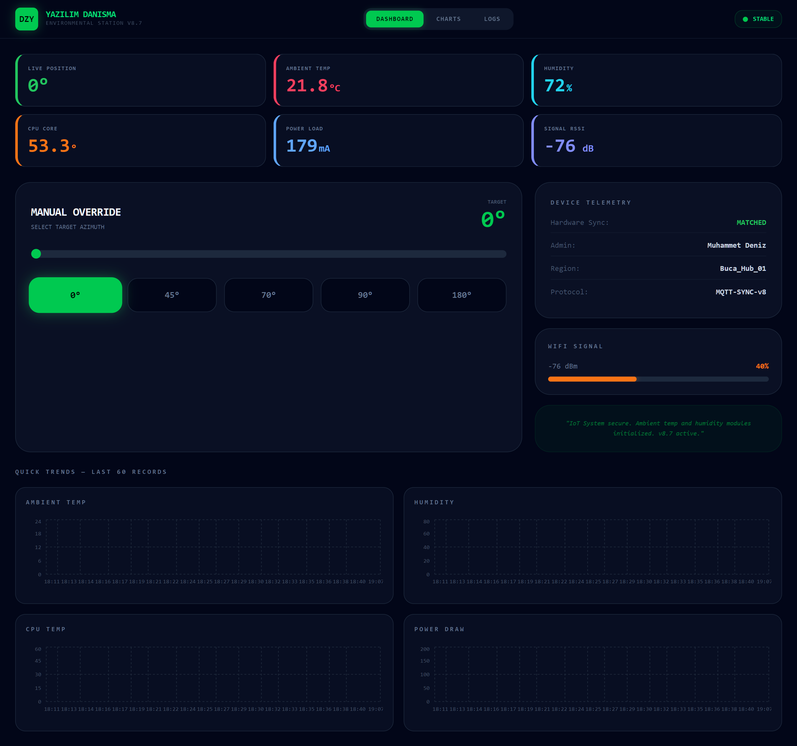

# DZY Servo Panel

> Real-time IoT telemetry dashboard with remote servo control.  
> Hardware meets cloud — ESP32 to Supabase to React.

🔴 **[Live Demo](https://esp32-henna.vercel.app/)**

---

## The Problem

Off-the-shelf remote PC control solutions required Bluetooth hubs, 
third-party mobile apps, and constant vendor updates — creating 
unnecessary dependency and cost.

This system replaced all of that with a custom ESP32-based device 
and a cloud-connected dashboard. Total hardware cost: ~$15.

---

## What It Does

- **Real-time telemetry** — temperature, humidity, CPU heat, 
  power draw, and WiFi signal streamed live via Supabase Realtime
- **Remote servo control** — set target angle from anywhere, 
  hardware syncs within seconds
- **Historical analysis** — filter logs by time range (1h to 7d), 
  visualize trends with interactive charts
- **Offline queue** — device stores readings locally when 
  WiFi drops, flushes on reconnect
- **Auto-return logic** — predefined angles (70°/90°) trigger 
  timed automatic return to 0°

---

## Architecture
